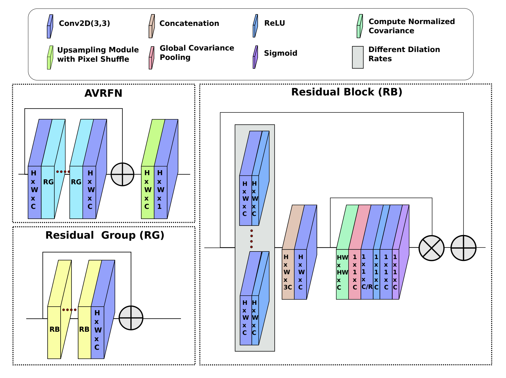
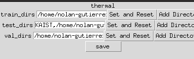
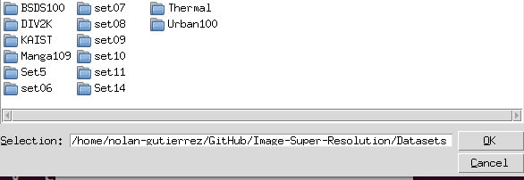

## Attention With Varying Receptive Fields Network

### Overview

A key application in computer vision is performing super-resolution of degraded
images by learning a mapping from low-resolution to high-resolution. We have
created a library of various super-resolution models and modules, along with
documentation, for thermal and RGB super-resolution. Specifically, we
implement experiments designed to determine how additions of enhanced
convolutions and novel modules encompassed in our attention with varying
receptive fields network affects performance gains for the task of image
super-resolution.

<p align="center">

</p>

This repository was created to contain the experiments and super-resolution
models for our 2021 ICVS paper titled "[Thermal Image Super-Resolution Using
Second-Order Channel Attention with Varying Receptive
Fields](https://arxiv.org/pdf/2108.00094.pdf)." The software contains deep
learning and computer vision code not only for thermal image super-resolution,
but also for super-resolution of the visual image space. 

### Citation

If you find this project useful, then please consider citing our work. 

```bibtex
@inproceedings{gutierrez2021thermal, 
  title={Thermal image super-resolution using second-order channel attention with varying receptive fields},
  author={Gutierrez, Nolan B and Beksi, William J},
  booktitle={Proceedings of the International Conference on Computer Vision Systems (ICVS)},
  pages={3--13},
  year={2021}
}
``` 

### Installation

To run the experiments within this repository, `opencv`, `numpy`, `tensorflow`,
and `pillow` need to be installed along with their dependencies. The experiments
were conducted on an Ubuntu 20.04 machine using an Anaconda 3 environment. The
experiments were run with an NVIDIA GPU and CUDA. To create the environment, run
the following commands from a terminal with Anaconda 3 installed.
  
Create the Anaconda environment:
 
`conda create -y -n myenv tensorflow==2.4.1 numpy==1.19.2  pip  pillow==7.2.0
tensorflow-gpu==2.5.0`
 
Activate the environment:
 
`conda activate myenv`
 
Install OpenCV:
 
`conda install -c conda-forge opencv`
 
### Usage
 
Our driver file is equipped with a simple GUI that allows you to select
datasets for training and testing. In the driver file, simply change the
boolean `save_dirs` to `True`. Next, to quickly set the directories which you
will be using run the following command:

`python train.py 2`

You will be presented with a GUI which allows you to select the proper dataset.
Use `Set and Reset` when erasing the current entry, and `Add Directory` when
adding a new directory to the list of directories. As of now, the program only
supports a single training directory but multiple testing directories.  Pressing
save will write the directories to a JSON file named `saved_dirs.json`. If using
the KAIST dataset, we recommend that you place the images in the root directory
following the defined list on line 60 of `train.py`.

#### Dataset Selection GUI
 

 
#### Selection of Datasets
 


This is highly recommended to do since the KAIST dataset is very large and our
current implementation takes every 200th image. When using the KAIST dataset for
evaluation, it is also recommended to simply add `"KAIST"` to the
`saved_dirs.json` file. If you are working with thermograms, then change the
variable `datasets` to `datasets = ['thermal']` and if working with both thermal
and RGB data, then change the variable `datasets` to `datasets = ['thermal',
'div2k']`. For convenience, here is an example of how `saved_dirs.json` should
look if using both thermal and RGB images.
 
```
{
  "thermal": {
    "train_dirs": [
      "./Datasets/Thermal/train/640_flir_hr"
    ],
    "test_dirs": [
      "KAIST",
      "./Datasets/Thermal/test/320_axis_mr",
      "./Datasets/Thermal/test/640_flir_hr",
      "./Datasets/Thermal/test/Flir_test",
      "./Datasets/Thermal/test/160_domo_lr"
    ],
    "val_dirs": [
      "./Datasets/Thermal/test/Flir_test"
    ]
  },
  "div2k": {
    "train_dirs": [
      "./Datasets/DIV2K/train"
    ],
    "test_dirs": [
      "./Datasets/Set14",
      "./Datasets/Set5",
      "./Datasets/DIV2K/test",
      "./Datasets/Urban100",
      "./Datasets/BSDS100",
      "./Datasets/Thermal/test/320_axis_mr",
      "./Datasets/Thermal/test/640_flir_hr",
      "./Datasets/Thermal/test/Flir_test",
      "./Datasets/Thermal/test/160_domo_lr"
    ],
    "val_dirs": [
      "./Datasets/DIV2K/test"
    ]
  }
}
```

In this JSON file, `Flir_test` refers to the [FLIR Thermal Dataset for Algorithm
Training](https://www.flir.com/oem/adas/adas-dataset-form/), `320_axis_mr,
640_flir_hr, 160_domo_lr` refers to the [Thermal Image Super-Resolution
Challenge](https://pbvs-workshop.github.io/datasets.html) dataset, and `KAIST`
refers to the [KAIST](https://soonminhwang.github.io/rgbt-ped-detection/)
dataset. 

We have created many different models in the file `ModelLists.py`. The program
is built such that you can select several of these models as defined in the
dictionary constructed in the `__init__(self)` method of the class `
Model_Lists` of `ModelLists.py`. If you want to train on additional models from
the `ModelLists.py` file, then add to the `modelnames` list on line 90 of
`train.py`:
 
`modelnames = ['rcan']` to `modelnames = ['rcan', 'rcan_DDSOCA']`    
 
After providing the appropriate datasets and models, the experiments may be
started by giving the current scale factor as a command line argument. For
example, to begin an experiment using the x4 upscaling factor, run the following
command in an Anaconda terminal:
 
`python train.py 4`

You now have the option of training, creating results, and evaluating, as
determined by the Booleans in lines 53-55. However, a model must be saved to run
the program without training. If you have selected a dataset and model, then the
checkpoint directory will default to `./model_name/dataset/scale`.

### Running Experiments

Our experiments require that `modelnames` is set as follows: 

`modelnames = ['rcan','rcan_dd','rcan_dd_comp','rcan_DDSOCA', 'rcan_soca']`

If you want to run experiments to reproduce our results, then run the following
commands:

```
python train.py 2
python train.py 3
python train.py 4
```

All of the results will be stored in the `./Data/` directory. Furthermore, each
result will be identified by its dataset, upscaling factor, and the name of the
model.
 
We also created a separate driver file named `test_bicubic.py`, which will
reproduce our results using the bicubic interpolation baseline found in our
paper. To reproduce these results (assuming that the datasets are set
correctly), simply run the following command: 

`python test_bicubic.py`

### License

[](https://github.com/robotic-vision-lab/Attention-With-Varying-Receptive-Fields-Network/blob/main/LICENSE)
