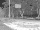
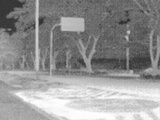
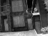
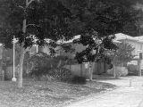

### Attention-With-Varying-Receptive-Fields-Network
 [](https://github.com/keras-team/keras/blob/master/LICENSE)

   
   
   
### Overview

A key application in computer vision is performing super-resolution of degraded
images by learning a mapping from degraded low-resolution images to
high-resolution images. This repository consists of a large library of different
super-resolution models and modules along with documentation of these modules
for thermal and RGB super-resolution. Specifically, we implement experiments
designed to find how additions of enhanced convolutions and novel modules
affects  performance gains for the task of super-resolution.

### Purpose

This software contains deep learning and computer vision code that may be used
Thermal Image Super-Resolution although it may also be used for super-resolution
of the visual image space. This repository was created to contain experiments
and numerous super-resolution models for our 2021 International Conference on
Computer Vision Systems paper entitled "Thermal Image Super-Resolution Using
Second-Order Channel Attention with Varying Receptive Fields". If you find this
project useful, then please consider citing our work:
 
 N. B. Gutierrez and W. J. Beksi, “Thermal image super-resolution using second-
order channel attention with varying receptive fields,” in *International 
Conference on Computer Vision Systems (ICVS)*, 2021. 

```bibtex
@inproceedings{gutierrez2021Thermal, 
  title={Thermal Image Super-Resolution Using Second-Order Channel Attention with
  Varying Receptive Fields},
  author ={Gutierrez, Nolan B and Beksi, William J},
  booktitle={International Conference on Computer Vision Systems (ICVS)},
  year={2021}
}
``` 
### Installation
To run the experiments within this repository, `opencv`, `numpy`, `tensorflow`,
and `pillow` need to be installed along with their dependencies. The experiments
were conducted on Ubuntu 20 using an Anaconda 3 environment. These experiments
were ran with a NVIDIA GPU and CUDA installed.  To create the environment, run 
the following commands from an Ubuntu terminal with Anaconda 3 installed:
  
Create the conda environment:
 
`conda create -y -n myenv tensorflow==2.4.1 numpy==1.19.2  pip  pillow==7.2.0
tensorflow-gpu==2.5.0`
 
Activate environment:
 
`conda activate myenv`
 
Install opencv:
 
`conda install -c conda-forge opencv`
 
### Usage
 
Our driver file is equipped with a simple GUI which allows the user to select
datasets for training and testing. In our driver file, simply change the boolean
`save_dirs` to `True`. Now, to quickly set the directories which you will be
using, run:

`python train.py 2`

You will be presented with a GUI which allows you to select the proper dataset.
Use `set and reset` when erasing the current entry and `Add Directory` when
adding a new directory to the list of directories. As of now, the program only
supports a single training directory but multiple testing directories. 
Pressing save will save the directories to a json file named `saved_dirs.json
`. If using the KAIST dataset, the user is recommended to place the images in 
the root directory following the defined list in line 60. This is highly 
recommended to do since the KAIST dataset is very large and our 
current  implementation takes every 200 images. When using the KAIST dataset 
for  evaluation, it is also recommended to simply add `"KAIST"` to the `
saved_dirs.json`  file. If the user is working with thermograms, then change 
the variable `datasets` to `datasets = ['thermal']` and if the user is working 
with both thermal and RGB data, then change the variable `datasets` to `
datasets = ['thermal', 'div2k']`. For convenience, here is an example of how 
`saved_dirs.json` should look if using both thermal and RGB images.
 
```
{
  "thermal": {
    "train_dirs": [
      "./Datasets/Thermal/train/640_flir_hr"
    ],
    "test_dirs": [
      "KAIST",
      "./Datasets/Thermal/test/320_axis_mr",
      "./Datasets/Thermal/test/640_flir_hr",
      "./Datasets/Thermal/test/Flir_test",
      "./Datasets/Thermal/test/160_domo_lr"
    ],
    "val_dirs": [
      "./Datasets/Thermal/test/Flir_test"
    ]
  },
  "div2k": {
    "train_dirs": [
      "./Datasets/DIV2K/train"
    ],
    "test_dirs": [
      "./Datasets/Set14",
      "./Datasets/Set5",
      "./Datasets/DIV2K/test",
      "./Datasets/Urban100",
      "./Datasets/BSDS100",
      "./Datasets/Thermal/test/320_axis_mr",
      "./Datasets/Thermal/test/640_flir_hr",
      "./Datasets/Thermal/test/Flir_test",
      "./Datasets/Thermal/test/160_domo_lr"
    ],
    "val_dirs": [
      "./Datasets/DIV2K/test"
    ]
  }
}
```
In this json, `Flir_test` refers to the Flir dataset, `320_axis_mr, 640_flir_hr,
160_domo_lr` refers to the TDAT challenge dataset, and `KAIST` refers to the
KAIST dataset. We have created many different models in the file named `
ModelLists.py`. The program is built so that the user can select several of 
these models as defined in the dictionary constructed in the `__init__(self)` 
method of the class `Model_Lists()`. If the user wants to train on additional 
models from the `ModelLists.py` file, then the user can add  to the `modelnames
` list on line  90 of `train.py`:    
`modelnames = ['rcan']` to `modelnames = ['rcan', 'rcan_DDSOCA']`
 

After the user has provided the appropriate datasets and models, the user can
run experiments, where the user must provide the current scale factor as a
command line argument. For example, to run an experiment using the x4 up-scaling
factor, the user can run the following command in an Anaconda terminal:
 
`python train.py 4`

The user has the option of training, creating results, and evaluating, as
determined by booleans in lines 53-54. However, a model must be saved to run the
program without training.  If the user has selected a dataset and model, then
the checkpoint directory will default to `./model_name/dataset/scale`.
 


 
### Running Experiments
Our experiments require that `modelnames` is set as follows: 

`modelnames = ['rcan','rcan_dd','rcan_dd_comp','rcan_DDSOCA', 'rcan_soca']`

If the user wants to run experiments to reproduce our results, then the user can
run the following commands:

```
python train.py 2
python train.py 3
python train.py 4
```
All of the results will be stored in the `./Data/` directory. Each result will
be identified by its dataset, upscaling factor, and the name of the model.
 
We also created a separate driver file named `test_bicubic.py`, which will
reproduce our results using the bicubic interpolation baseline found in our paper.
To reproduce the bicubic interpolation results (Assuming that the datasets are
set correctly), simply run the following command: 

`python test_bicubic.py`

### License
[MIT](https://github.com/robotic-vision-lab/Attention-With-Varying-Receptive-Fields-Network/blob/main/LICENSE)
